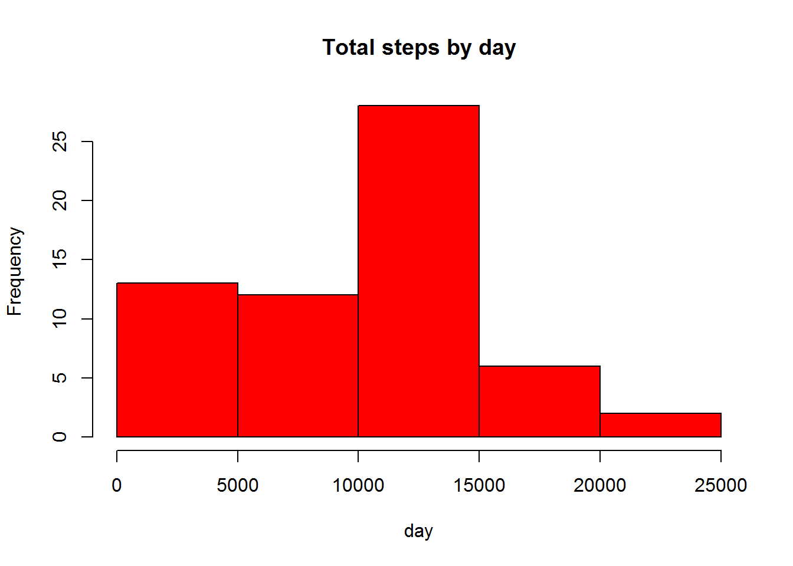
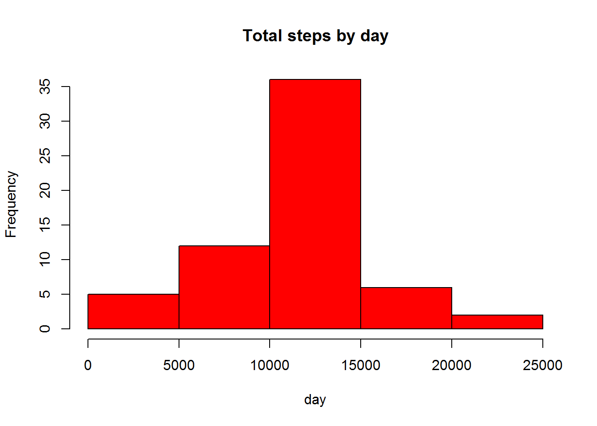
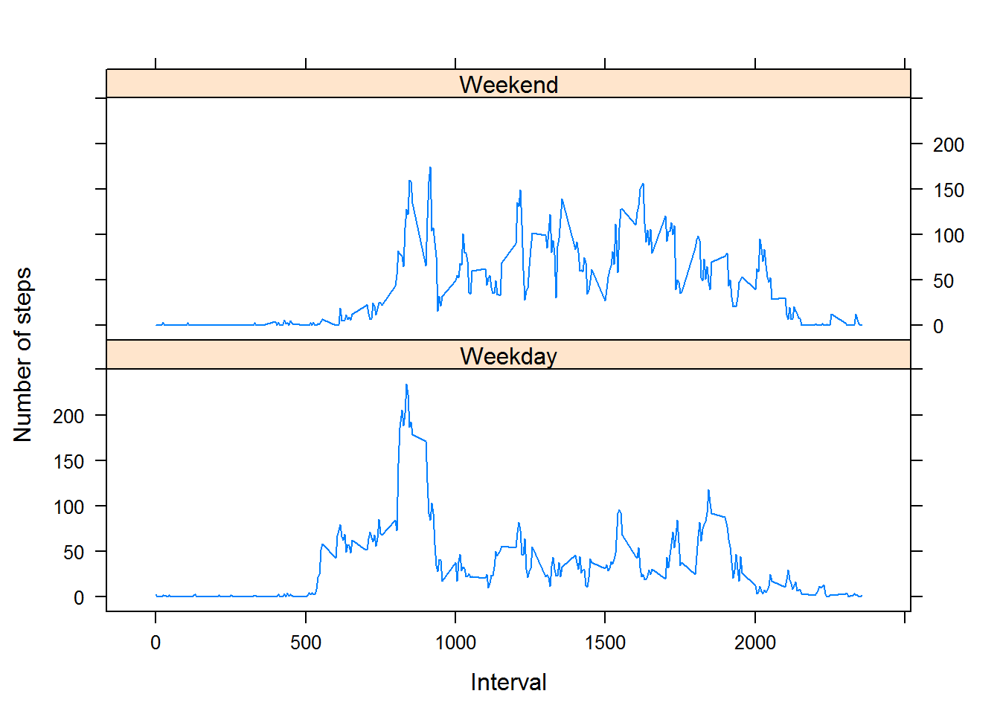

``` r
knitr::opts_chunk$set(fig.path="figures/")
```

Loading and preprocessing the data
----------------------------------

``` r
unzip(zipfile = "activity.zip")
activity <- read.csv("activity.csv")
activity$date <- as.Date(activity$date, "%Y-%m-%d")
```

What is mean total number of steps taken per day?
-------------------------------------------------

``` r
library(ggplot2)
```

    ## Warning: package 'ggplot2' was built under R version 3.3.2

``` r
total.steps <- tapply(activity$steps, activity$date, FUN = sum, na.rm = TRUE)
hist(total.steps, main = "Total steps by day", xlab = "day", col = "red")
```

 \#\#\# mean and median

``` r
mean(total.steps, na.rm = TRUE)
```

    ## [1] 9354.23

``` r
median(total.steps, na.rm = TRUE)
```

    ## [1] 10395

What is the average daily activity pattern?
-------------------------------------------

``` r
library(ggplot2)
averages <- aggregate(x = list(steps = activity$steps), by = list(interval = activity$interval), 
    FUN = mean, na.rm = TRUE)
ggplot(data = averages, aes(x = interval, y = steps)) + geom_line() + xlab("5-minute interval") + 
    ylab("average number of steps taken")
```


### Which 5-minute-intervall contains the maximum number of steps?

``` r
averages[which.max(averages$steps), ]
```

    ##     interval    steps
    ## 104      835 206.1698

Imputing missing values
-----------------------

### Total number

``` r
missing <- is.na(activity$steps)
table(missing)
```

    ## missing
    ## FALSE  TRUE 
    ## 15264  2304

### All of the missing values are filled in with mean value for that 5-minute interval.

### Replace each missing value with the mean value of its 5-minute interval

``` r
  fill.value <- function(steps, interval) {
    filled <- NA
    if (!is.na(steps)) 
        filled <- c(steps) else filled <- (averages[averages$interval == interval, "steps"])
    return(filled)
}
filled.data <- activity
filled.data$steps <- mapply(fill.value, filled.data$steps, filled.data$interval)
```

### histogram of the total number of steps taken each day and mean and median total number of steps

``` r
StepsTotal <- aggregate(steps ~ date, data = filled.data, sum, na.rm = TRUE)
hist(StepsTotal$steps, main = "Total steps by day", xlab = "day", col = "red")
```



### mean and median

``` r
mean(StepsTotal$steps)
```

    ## [1] 10766.19

``` r
median(StepsTotal$steps)
```

    ## [1] 10766.19

### Mean and median values are higher after imputing missing data.

Are there differences in activity patterns between weekdays and weekends?
-------------------------------------------------------------------------

### Create factor variable

``` r
day <- weekdays(activity$date)
daylevel <- vector()
for (i in 1:nrow(activity)) {
    if (day[i] == "Samstag") {
        daylevel[i] <- "Weekend"
    } else if (day[i] == "Sonntag") {
        daylevel[i] <- "Weekend"
    } else {
        daylevel[i] <- "Weekday"
    }
}
activity$daylevel <- daylevel
activity$daylevel <- factor(activity$daylevel)

stepsByDay <- aggregate(steps ~ interval + daylevel, data = activity, mean)
names(stepsByDay) <- c("interval", "daylevel", "steps")
```

### panel plot

``` r
library(lattice)
xyplot(steps ~ interval | daylevel, stepsByDay, type = "l", layout = c(1, 2), 
    xlab = "Interval", ylab = "Number of steps")
```


